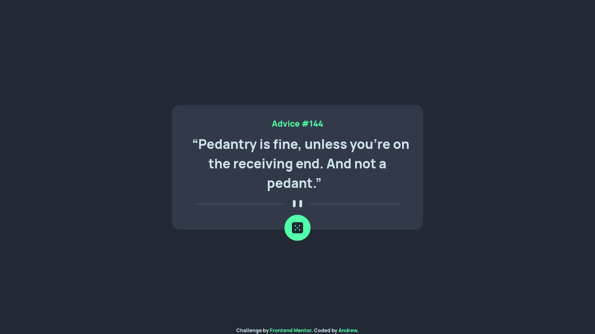

# Frontend Mentor - Advice generator app solution

This is a solution to the [Advice generator app challenge on Frontend Mentor](https://www.frontendmentor.io/challenges/advice-generator-app-QdUG-13db). Frontend Mentor challenges help you improve your coding skills by building realistic projects.

## Table of contents

- [Overview](#overview)
  - [The challenge](#the-challenge)
  - [Screenshot](#screenshot)
  - [Links](#links)
- [Built with](#built-with)
- [Author](#author)

## Overview

### The challenge

Users should be able to:

- View the optimal layout for the app depending on their device's screen size
- See hover states for all interactive elements on the page
- Generate a new piece of advice by clicking the dice icon

### Screenshot

### Links

- Solution URL: [frontendmentor.io](https://www.frontendmentor.io/solutions/es6-javascript-with-fetch-and-arrow-functions-BJm8hQczc)
- Live Site URL: [https://whoamihealay.github.io/advice-generator-app/](https://whoamihealay.github.io/advice-generator-app/)

## Built with

- HTML5
- Sass
- Javascript

## Author

- Website - [whoamiandrew](https://whoamiandrew.com/)
- Frontend Mentor - [@whoamihealay](https://www.frontendmentor.io/profile/whoamihealay)
- Linkedin - [@andrewsouthern01](https://www.linkedin.com/in/andrewsouthern01/)
